# PHÂN TÍCH THIẾT KẾ HỆ THỐNG TICKETRUSH

Giảng viên: ........................................  
Nhóm thực hiện: Nhóm 8  
Hệ thống: TicketRush Platform  
Thời gian: Tháng 05 năm 2026

## MỤC LỤC

- Danh sách hình ảnh
- Danh mục từ viết tắt
- Giải thích thuật ngữ
- Đặt vấn đề
- Chương I: Xác định bài toán
- Chương II: Phân tích yêu cầu người dùng
- Chương III: Thiết kế hệ thống
  - 3.1. Biểu đồ Use Case
  - 3.2. Biểu đồ hoạt động
  - 3.3. Biểu đồ trình tự
  - 3.4. Biểu đồ cộng tác
  - 3.5. Biểu đồ lớp
  - 3.6. Biểu đồ trạng thái
  - 3.7. Biểu đồ thành phần
  - 3.8. Biểu đồ triển khai
- Chương IV: Đối chiếu và kết luận

## DANH SÁCH HÌNH ẢNH

| Hình | Tên biểu đồ |
| --- | --- |
| Hình 1 | Biểu đồ use case khách truy cập: xác thực và khám phá |
| Hình 2 | Biểu đồ use case người dùng: đặt vé và thông báo |
| Hình 3 | Biểu đồ use case quản trị viên và nhà tổ chức |
| Hình 4 | Biểu đồ use case tích hợp hệ thống ngoài |
| Hình 5 | Biểu đồ hoạt động đăng ký, đăng nhập và refresh token |
| Hình 6 | Biểu đồ hoạt động khám phá event/movie |
| Hình 7 | Biểu đồ hoạt động hàng đợi ảo |
| Hình 8 | Biểu đồ hoạt động giữ ghế |
| Hình 9 | Biểu đồ hoạt động checkout, xác nhận, hủy và hết hạn |
| Hình 10 | Biểu đồ hoạt động quản trị tạo event/movie |
| Hình 11 | Biểu đồ trình tự đăng nhập và refresh token |
| Hình 12 | Biểu đồ trình tự xem catalog, chi tiết và review |
| Hình 13 | Biểu đồ trình tự hàng đợi ảo |
| Hình 14 | Biểu đồ trình tự giữ ghế và locking |
| Hình 15 | Biểu đồ trình tự xác nhận booking và gửi email |
| Hình 16 | Biểu đồ trình tự hủy booking và release expired |
| Hình 17 | Biểu đồ trình tự quản trị tạo event/showtime/seat map |
| Hình 18 | Biểu đồ trình tự quản lý role và permission |
| Hình 19 | Biểu đồ trình tự upload media hồ sơ |
| Hình 20 | Biểu đồ cộng tác đăng nhập |
| Hình 21 | Biểu đồ cộng tác xem catalog/chi tiết |
| Hình 22 | Biểu đồ cộng tác hàng đợi ảo |
| Hình 23 | Biểu đồ cộng tác giữ ghế |
| Hình 24 | Biểu đồ cộng tác confirm booking và email |
| Hình 25 | Biểu đồ cộng tác admin quản lý event |
| Hình 26 | Biểu đồ cộng tác role/permission |
| Hình 27 | Biểu đồ cộng tác notification/email |
| Hình 28 | Biểu đồ lớp User/Auth/Role |
| Hình 29 | Biểu đồ lớp Event/Showtime/Seat map |
| Hình 30 | Biểu đồ lớp Booking/Seat/Ticket |
| Hình 31 | Biểu đồ trạng thái Booking |
| Hình 32 | Biểu đồ trạng thái ghế theo showtime |
| Hình 33 | Biểu đồ trạng thái phiên người dùng |
| Hình 34 | Biểu đồ trạng thái virtual queue |
| Hình 35 | Biểu đồ thành phần User Service |
| Hình 36 | Biểu đồ thành phần Event Service |
| Hình 37 | Biểu đồ thành phần Booking Service |
| Hình 38 | Biểu đồ thành phần tổng thể TicketRush |
| Hình 39 | Biểu đồ triển khai Docker Compose |
| Hình 40 | Biểu đồ triển khai request routing qua Nginx |

## DANH MỤC TỪ VIẾT TẮT

| Từ viết tắt | Nội dung cụ thể |
| --- | --- |
| API | Application Programming Interface |
| CSDL | Cơ sở dữ liệu |
| JWT | JSON Web Token |
| OAuth | Open Authorization, cơ chế xác thực qua bên thứ ba |
| SMTP | Simple Mail Transfer Protocol |
| WebSocket | Kênh kết nối hai chiều realtime |
| QR | Quick Response code, mã vé hiển thị cho người dùng |
| CRUD | Create, Read, Update, Delete |

## GIẢI THÍCH THUẬT NGỮ

| Thuật ngữ | Giải thích |
| --- | --- |
| TicketRush | Nền tảng khám phá sự kiện/phim, chọn ghế, đặt vé và quản trị catalog. |
| Event/Movie | Loại nội dung được bán vé trong hệ thống. Event Service lưu trường event_type gồm EVENT và MOVIE. |
| Showtime | Suất chiếu hoặc khung giờ diễn ra event/movie, gắn với địa điểm, seat map và queue setting. |
| Seat map | Sơ đồ ghế của một venue, gồm nhiều ghế có hạng STANDARD, VIP, PREMIUM, DELUXE. |
| Booking hold | Trạng thái giữ ghế tạm thời. Booking ở trạng thái HOLDING, ghế ở trạng thái HOLDING và có thời hạn expires_at. |
| Virtual queue | Hàng đợi ảo dùng Redis để giới hạn số người cùng vào phòng chọn ghế của một showtime. |
| Role/Permission | Cơ chế phân quyền gồm role legacy USER/ADMIN và role động qua role_definitions, role_permissions, user_roles. |

## ĐẶT VẤN ĐỀ

Các hệ thống bán vé trực tuyến cần giải quyết đồng thời nhiều yêu cầu: người dùng phải tìm được sự kiện nhanh, xem thông tin rõ ràng, chọn ghế trực quan và đặt vé thuận tiện; hệ thống phải chống bán trùng ghế khi nhiều người thao tác cùng lúc; bộ phận vận hành cần công cụ quản trị sự kiện, suất chiếu, sơ đồ ghế, người dùng và phân quyền.

TicketRush được xây dựng theo hướng tách miền nghiệp vụ thành nhiều service. React Web đảm nhiệm giao diện, User Service quản lý xác thực và hồ sơ, Event Service quản lý catalog sự kiện/phim, Booking Service xử lý giữ ghế/đặt vé, PostgreSQL lưu dữ liệu nghiệp vụ, Redis hỗ trợ khóa ghế và hàng đợi ảo, MinIO lưu media. Báo cáo này trình bày phân tích thiết kế hướng đối tượng cho hệ thống TicketRush.

## CHƯƠNG I: XÁC ĐỊNH BÀI TOÁN

Hệ thống TicketRush cho phép khách truy cập xem danh sách sự kiện/phim, xem chi tiết suất chiếu, đăng ký/đăng nhập, chọn ghế, giữ ghế, xác nhận đặt vé, xem vé QR và nhận email xác nhận. Nhóm quản trị hoặc nhân sự có quyền phù hợp có thể tạo/sửa/xóa event, movie, showtime, seat map, quản lý người dùng, role, permission và xem dashboard số liệu booking/doanh thu.

Phạm vi hệ thống gồm các khối chính sau:

| Khối | Công nghệ | Vai trò |
| --- | --- | --- |
| TicketRushPlatform_Web | React, TypeScript, Vite, Nginx | Giao diện người dùng, admin, gọi API và WebSocket |
| TicketRushPlatform_User_Service | Flask/Python | Auth, JWT, OAuth, hồ sơ, user, role, notification, email, media |
| TicketRushPlatform_Event_Service | Go/Gin/GORM | Event/movie catalog, review, showtime, seat map |
| TicketRushPlatform_Booking_Service | Go/Gin/GORM | Booking, giữ ghế, xác nhận/hủy, trạng thái ghế realtime, queue, dashboard |
| TicketRushPlatform_Migration_Service | Go + SQL migrations | Khởi tạo và nâng cấp schema PostgreSQL |
| Hạ tầng triển khai | Docker Compose | Triển khai Postgres, Redis, MinIO, API services và Web |

## CHƯƠNG II: PHÂN TÍCH YÊU CẦU NGƯỜI DÙNG

### 2.1. Yêu cầu chức năng

| Tác nhân | Yêu cầu chức năng |
| --- | --- |
| Khách truy cập | Xem danh sách sự kiện/phim, tìm kiếm/lọc, xem chi tiết event, xem showtime, đăng ký, đăng nhập, đăng nhập OAuth, quên/đặt lại mật khẩu. |
| Người dùng đã đăng nhập | Cập nhật hồ sơ, upload avatar/video, vào hàng đợi ảo, xem trạng thái ghế realtime, giữ ghế, xác nhận/hủy booking, xem vé QR, xem thông báo, gửi đánh giá. |
| Nhà tổ chức/Event Owner | Tạo/sửa event hoặc movie, cập nhật suất chiếu, thiết kế seat map, theo dõi dashboard nếu có quyền. |
| Quản trị viên | Quản lý toàn bộ event/movie, người dùng, role, permission, dashboard booking/doanh thu, thống kê người dùng. |
| Hệ thống ngoài | OAuth provider xác thực xã hội, SMTP/email worker gửi email, MinIO lưu media, TMDB cung cấp metadata phim. |

### 2.2. Yêu cầu phi chức năng

| Nhóm yêu cầu | Nội dung |
| --- | --- |
| Bảo mật | JWT access token, refresh token rotation, OAuth login, admin guard, permission guard, rate limit cho auth endpoint. |
| Toàn vẹn dữ liệu | PostgreSQL transaction khi hold/confirm/cancel booking; unique constraint cho ghế trong showtime; trạng thái booking/seat tách rõ. |
| Chống cạnh tranh ghế | Redis seat lock và transaction khóa bản ghi show_time_seats khi nhiều người giữ cùng ghế. |
| Realtime | WebSocket /showtimes/{id}/seats/ws broadcast trạng thái ghế sau hold/confirm/cancel/release expired. |
| Khả dụng triển khai | Docker Compose có healthcheck Postgres/Redis/MinIO và quan hệ phụ thuộc giữa migration, API, web. |
| Quan sát hệ thống | Các service backend có metrics, request logging, request id và health endpoint. |
| Khả năng mở rộng | Tách service theo domain User/Event/Booking, có Redis cho queue và MinIO cho object storage. |

## CHƯƠNG III: THIẾT KẾ HỆ THỐNG

### 3.1. BIỂU ĐỒ USE CASE

#### 3.1.1. Xác định các tác nhân

Các tác nhân chính gồm khách truy cập, người dùng đã đăng nhập, nhà tổ chức/event owner, quản trị viên và các hệ thống ngoài như OAuth provider, SMTP, TMDB, MinIO, Redis, PostgreSQL.

#### 3.1.2. Xác định các use case

Use case được chia theo vai trò để thể hiện rõ quyền và phạm vi thao tác. Khách truy cập tập trung vào khám phá và xác thực. Người dùng đăng nhập tập trung vào đặt vé, hồ sơ và thông báo. Nhóm quản trị tập trung vào catalog, người dùng và phân quyền. Các hệ thống ngoài hỗ trợ xác thực, gửi email, lưu media, queue và lưu trữ dữ liệu.

#### 3.1.3. Biểu đồ use case khách truy cập

Biểu đồ mô tả các chức năng mà khách chưa đăng nhập có thể thực hiện: xem catalog, tìm kiếm, xem chi tiết, đăng ký, đăng nhập, đăng nhập OAuth và khôi phục mật khẩu.

**Hình 1. Biểu đồ use case khách truy cập: xác thực và khám phá**

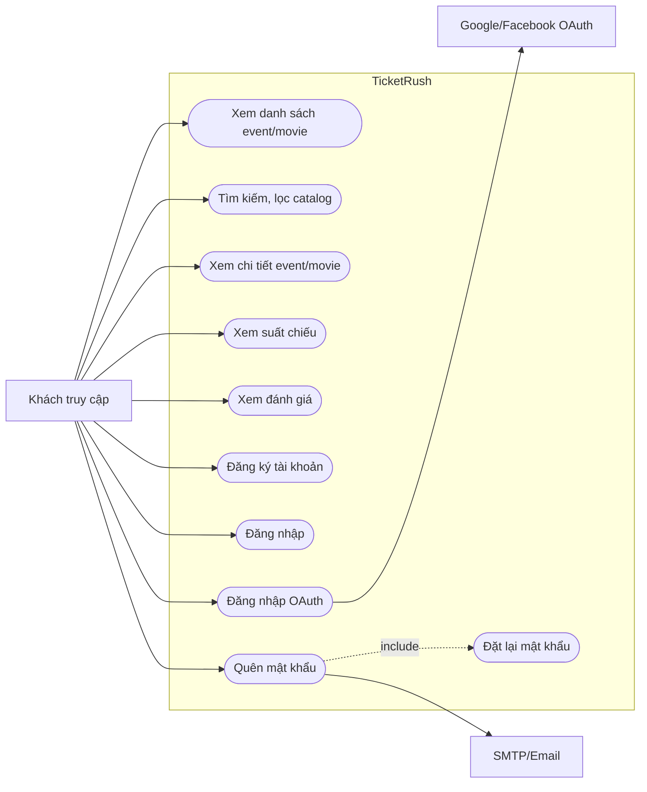
```mermaid
flowchart LR
  guest["Khách truy cập"]
  oauth["Google/Facebook OAuth"]
  smtp["SMTP/Email"]

  subgraph tr["TicketRush"]
    browse(["Xem danh sách event/movie"])
    search(["Tìm kiếm, lọc catalog"])
    detail(["Xem chi tiết event/movie"])
    showtimes(["Xem suất chiếu"])
    reviews(["Xem đánh giá"])
    register(["Đăng ký tài khoản"])
    login(["Đăng nhập"])
    oauthLogin(["Đăng nhập OAuth"])
    forgot(["Quên mật khẩu"])
    reset(["Đặt lại mật khẩu"])
  end

  guest --> browse
  guest --> search
  guest --> detail
  guest --> showtimes
  guest --> reviews
  guest --> register
  guest --> login
  guest --> oauthLogin
  guest --> forgot
  forgot -. "include" .-> reset
  oauthLogin --> oauth
  forgot --> smtp

```

#### 3.1.4. Biểu đồ use case người dùng đã đăng nhập

Biểu đồ mô tả nhóm chức năng sau khi đăng nhập: cập nhật hồ sơ, gửi đánh giá, vào hàng đợi, xem ghế realtime, giữ ghế, checkout, xem vé QR và xử lý thông báo.

**Hình 2. Biểu đồ use case người dùng: đặt vé và thông báo**

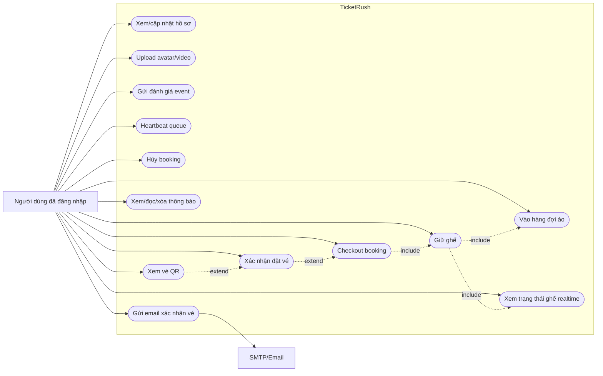
```mermaid
flowchart LR
  customer["Người dùng đã đăng nhập"]
  smtp["SMTP/Email"]

  subgraph tr["TicketRush"]
    profile(["Xem/cập nhật hồ sơ"])
    upload(["Upload avatar/video"])
    review(["Gửi đánh giá event"])
    joinQueue(["Vào hàng đợi ảo"])
    heartbeat(["Heartbeat queue"])
    seatStatus(["Xem trạng thái ghế realtime"])
    hold(["Giữ ghế"])
    checkout(["Checkout booking"])
    confirm(["Xác nhận đặt vé"])
    cancel(["Hủy booking"])
    tickets(["Xem vé QR"])
    notifications(["Xem/đọc/xóa thông báo"])
    emailTicket(["Gửi email xác nhận vé"])
  end

  customer --> profile
  customer --> upload
  customer --> review
  customer --> joinQueue
  customer --> heartbeat
  customer --> seatStatus
  customer --> hold
  customer --> checkout
  customer --> confirm
  customer --> cancel
  customer --> tickets
  customer --> notifications
  customer --> emailTicket

  hold -. "include" .-> joinQueue
  hold -. "include" .-> seatStatus
  checkout -. "include" .-> hold
  confirm -. "extend" .-> checkout
  tickets -. "extend" .-> confirm
  emailTicket --> smtp

```

#### 3.1.5. Biểu đồ use case quản trị

Biểu đồ mô tả các chức năng quản trị event/movie, suất chiếu, seat map, người dùng, role, permission và dashboard.

**Hình 3. Biểu đồ use case quản trị viên và nhà tổ chức**

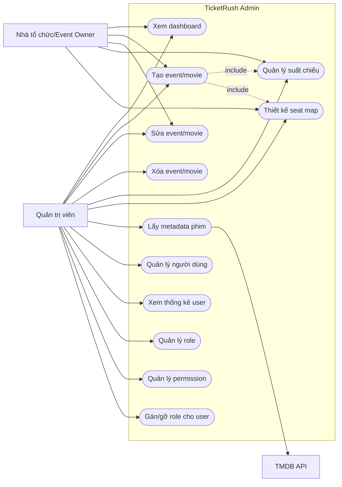
```mermaid
flowchart LR
  admin["Quản trị viên"]
  organizer["Nhà tổ chức/Event Owner"]
  tmdb["TMDB API"]

  subgraph tr["TicketRush Admin"]
    dashboard(["Xem dashboard"])
    createEvent(["Tạo event/movie"])
    updateEvent(["Sửa event/movie"])
    deleteEvent(["Xóa event/movie"])
    manageShowtime(["Quản lý suất chiếu"])
    designSeatMap(["Thiết kế seat map"])
    importMovie(["Lấy metadata phim"])
    manageUsers(["Quản lý người dùng"])
    userStats(["Xem thống kê user"])
    manageRoles(["Quản lý role"])
    managePermissions(["Quản lý permission"])
    assignRoles(["Gán/gỡ role cho user"])
  end

  organizer --> dashboard
  organizer --> createEvent
  organizer --> updateEvent
  organizer --> manageShowtime
  organizer --> designSeatMap

  admin --> dashboard
  admin --> createEvent
  admin --> updateEvent
  admin --> deleteEvent
  admin --> manageShowtime
  admin --> designSeatMap
  admin --> importMovie
  admin --> manageUsers
  admin --> userStats
  admin --> manageRoles
  admin --> managePermissions
  admin --> assignRoles

  createEvent -. "include" .-> manageShowtime
  createEvent -. "include" .-> designSeatMap
  importMovie --> tmdb

```

#### 3.1.6. Biểu đồ use case tích hợp ngoài

Biểu đồ mô tả tương tác giữa TicketRush và OAuth provider, SMTP, TMDB, MinIO, Redis và PostgreSQL.

**Hình 4. Biểu đồ use case tích hợp hệ thống ngoài**

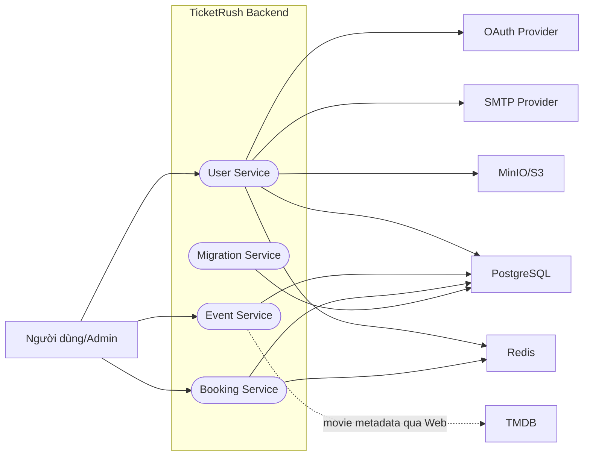
```mermaid
flowchart LR
  user["Người dùng/Admin"]
  oauth["OAuth Provider"]
  tmdb["TMDB"]
  smtp["SMTP Provider"]
  minio["MinIO/S3"]
  redis["Redis"]
  postgres["PostgreSQL"]

  subgraph tr["TicketRush Backend"]
    userApi(["User Service"])
    eventApi(["Event Service"])
    bookingApi(["Booking Service"])
    migration(["Migration Service"])
  end

  user --> userApi
  user --> eventApi
  user --> bookingApi
  userApi --> oauth
  userApi --> smtp
  userApi --> minio
  userApi --> postgres
  userApi --> redis
  eventApi --> postgres
  bookingApi --> postgres
  bookingApi --> redis
  migration --> postgres
  eventApi -. "movie metadata qua Web" .-> tmdb

```

### 3.2. BIỂU ĐỒ HOẠT ĐỘNG

Các biểu đồ hoạt động thể hiện dòng xử lý theo từng quy trình nghiệp vụ quan trọng, từ xác thực đến đặt vé và quản trị catalog.

#### 3.2.1. Hoạt động xác thực

Quy trình xác thực bắt đầu từ màn hình đăng nhập/đăng ký, kiểm tra dữ liệu, cấp access token và refresh token, sau đó tải hồ sơ người dùng.

**Hình 5. Biểu đồ hoạt động đăng ký, đăng nhập và refresh token**

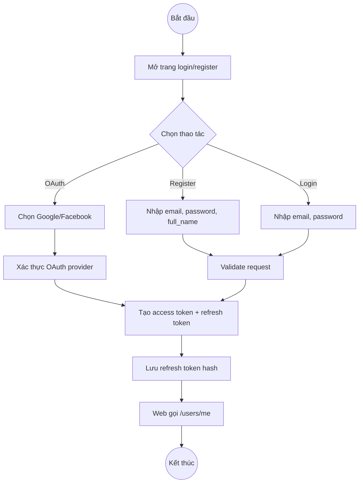
```mermaid
flowchart TD
  start((Bắt đầu))
  open["Mở trang login/register"]
  choose{"Chọn thao tác"}
  register["Nhập email, password, full_name"]
  login["Nhập email, password"]
  oauth["Chọn Google/Facebook"]
  validate["Validate request"]
  provider["Xác thực OAuth provider"]
  issue["Tạo access token + refresh token"]
  save["Lưu refresh token hash"]
  me["Web gọi /users/me"]
  finish((Kết thúc))

  start --> open --> choose
  choose -- "Register" --> register --> validate
  choose -- "Login" --> login --> validate
  choose -- "OAuth" --> oauth --> provider --> issue
  validate --> issue --> save --> me --> finish

```

#### 3.2.2. Hoạt động khám phá catalog

Quy trình người dùng xem danh sách event/movie, lọc theo query, mở chi tiết, tải showtime và review trước khi quyết định đặt vé.

**Hình 6. Biểu đồ hoạt động khám phá event/movie**

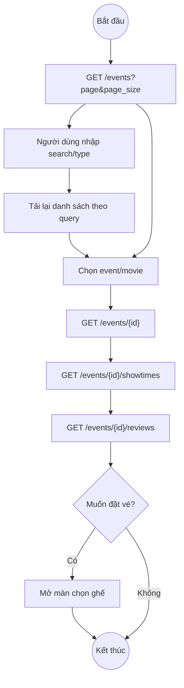
```mermaid
flowchart TD
  start((Bắt đầu))
  list["GET /events?page&page_size"]
  filter["Người dùng nhập search/type"]
  reload["Tải lại danh sách theo query"]
  choose["Chọn event/movie"]
  detail["GET /events/{id}"]
  showtimes["GET /events/{id}/showtimes"]
  reviews["GET /events/{id}/reviews"]
  decide{"Muốn đặt vé?"}
  seats["Mở màn chọn ghế"]
  finish((Kết thúc))

  start --> list --> filter --> reload --> choose
  list --> choose
  choose --> detail --> showtimes --> reviews --> decide
  decide -- "Có" --> seats --> finish
  decide -- "Không" --> finish

```

#### 3.2.3. Hoạt động hàng đợi ảo

Quy trình kiểm tra showtime có bật queue hay không, join queue, heartbeat và cho người dùng vào phòng chọn ghế khi đến lượt.

**Hình 7. Biểu đồ hoạt động hàng đợi ảo**

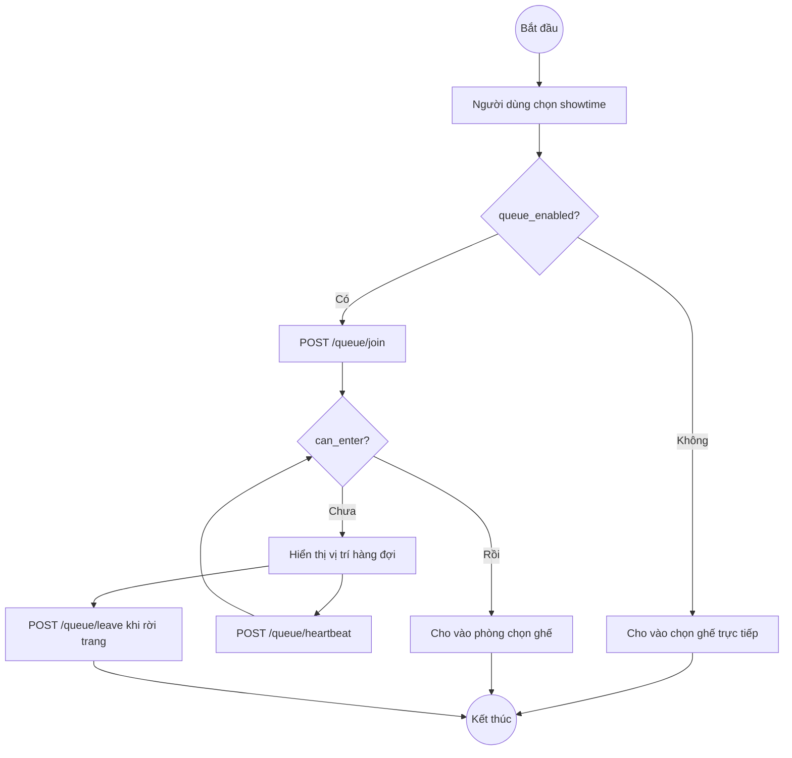
```mermaid
flowchart TD
  start((Bắt đầu))
  select["Người dùng chọn showtime"]
  check{"queue_enabled?"}
  bypass["Cho vào chọn ghế trực tiếp"]
  join["POST /queue/join"]
  status{"can_enter?"}
  wait["Hiển thị vị trí hàng đợi"]
  heartbeat["POST /queue/heartbeat"]
  enter["Cho vào phòng chọn ghế"]
  leave["POST /queue/leave khi rời trang"]
  finish((Kết thúc))

  start --> select --> check
  check -- "Không" --> bypass --> finish
  check -- "Có" --> join --> status
  status -- "Chưa" --> wait --> heartbeat --> status
  status -- "Rồi" --> enter --> finish
  wait --> leave --> finish

```

#### 3.2.4. Hoạt động giữ ghế

Quy trình giữ ghế gồm xác thực JWT, kiểm tra queue session, kiểm tra giới hạn vé, khóa Redis, transaction PostgreSQL và broadcast trạng thái ghế.

**Hình 8. Biểu đồ hoạt động giữ ghế**

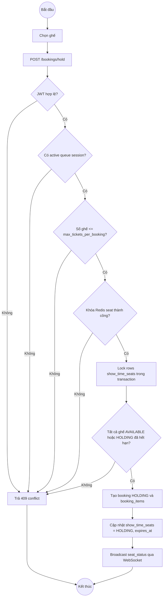
```mermaid
flowchart TD
  start((Bắt đầu))
  choose["Chọn ghế"]
  submit["POST /bookings/hold"]
  auth{"JWT hợp lệ?"}
  queue{"Có active queue session?"}
  maxTicket{"Số ghế <= max_tickets_per_booking?"}
  redis{"Khóa Redis seat thành công?"}
  dbLock["Lock rows show_time_seats trong transaction"]
  available{"Tất cả ghế AVAILABLE hoặc HOLDING đã hết hạn?"}
  create["Tạo booking HOLDING và booking_items"]
  update["Cập nhật show_time_seats = HOLDING, expires_at"]
  broadcast["Broadcast seat_status qua WebSocket"]
  conflict["Trả 409 conflict"]
  finish((Kết thúc))

  start --> choose --> submit --> auth
  auth -- "Không" --> conflict
  auth -- "Có" --> queue
  queue -- "Không" --> conflict
  queue -- "Có" --> maxTicket
  maxTicket -- "Không" --> conflict
  maxTicket -- "Có" --> redis
  redis -- "Không" --> conflict
  redis -- "Có" --> dbLock --> available
  available -- "Không" --> conflict
  available -- "Có" --> create --> update --> broadcast --> finish
  conflict --> finish

```

#### 3.2.5. Hoạt động checkout

Quy trình từ booking HOLDING sang PAID, CANCELED hoặc EXPIRED, đồng thời cập nhật trạng thái ghế tương ứng.

**Hình 9. Biểu đồ hoạt động checkout, xác nhận, hủy và hết hạn**

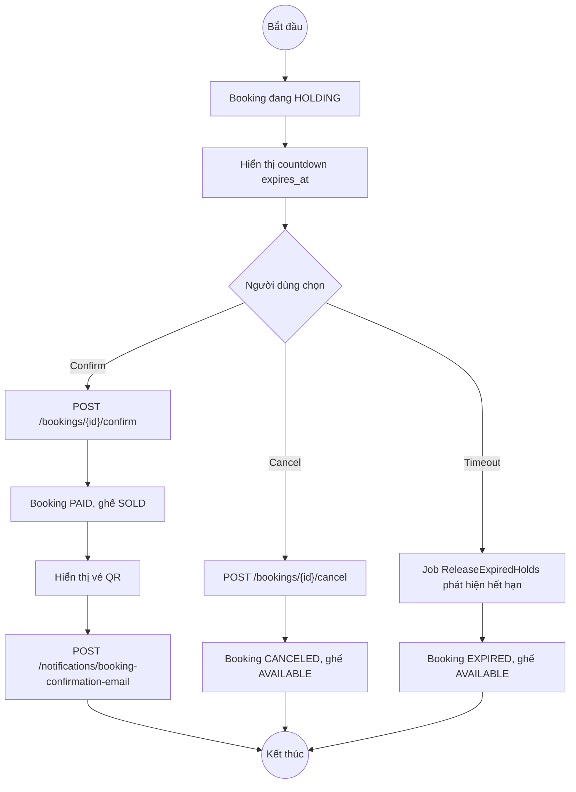
```mermaid
flowchart TD
  start((Bắt đầu))
  holding["Booking đang HOLDING"]
  countdown["Hiển thị countdown expires_at"]
  choice{"Người dùng chọn"}
  confirm["POST /bookings/{id}/confirm"]
  cancel["POST /bookings/{id}/cancel"]
  expired["Job ReleaseExpiredHolds phát hiện hết hạn"]
  paid["Booking PAID, ghế SOLD"]
  canceled["Booking CANCELED, ghế AVAILABLE"]
  expiredState["Booking EXPIRED, ghế AVAILABLE"]
  qr["Hiển thị vé QR"]
  email["POST /notifications/booking-confirmation-email"]
  finish((Kết thúc))

  start --> holding --> countdown --> choice
  choice -- "Confirm" --> confirm --> paid --> qr --> email --> finish
  choice -- "Cancel" --> cancel --> canceled --> finish
  choice -- "Timeout" --> expired --> expiredState --> finish

```

#### 3.2.6. Hoạt động quản trị catalog

Quy trình admin/event owner tạo event/movie, có thể lấy metadata phim, thiết kế seat map, nhập showtime và lưu catalog.

**Hình 10. Biểu đồ hoạt động quản trị tạo event/movie**

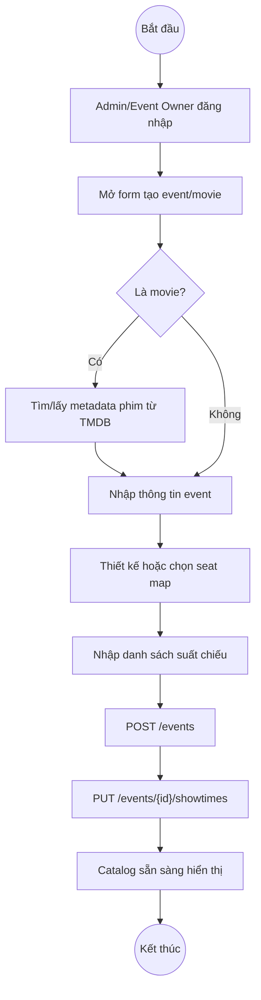
```mermaid
flowchart TD
  start((Bắt đầu))
  auth["Admin/Event Owner đăng nhập"]
  form["Mở form tạo event/movie"]
  movie{"Là movie?"}
  tmdb["Tìm/lấy metadata phim từ TMDB"]
  input["Nhập thông tin event"]
  seatMap["Thiết kế hoặc chọn seat map"]
  showtimes["Nhập danh sách suất chiếu"]
  saveEvent["POST /events"]
  saveShowtimes["PUT /events/{id}/showtimes"]
  publish["Catalog sẵn sàng hiển thị"]
  finish((Kết thúc))

  start --> auth --> form --> movie
  movie -- "Có" --> tmdb --> input
  movie -- "Không" --> input
  input --> seatMap --> showtimes --> saveEvent --> saveShowtimes --> publish --> finish

```

### 3.3. BIỂU ĐỒ TRÌNH TỰ

Các biểu đồ trình tự mô tả thứ tự thông điệp giữa actor, Web client, backend services, Redis, PostgreSQL và các hệ thống phụ trợ.

#### 3.3.1. Trình tự đăng nhập

Biểu đồ mô tả tương tác giữa người dùng, React Web, AuthContext, User Service và PostgreSQL trong quá trình đăng nhập và refresh token.

**Hình 11. Biểu đồ trình tự đăng nhập và refresh token**

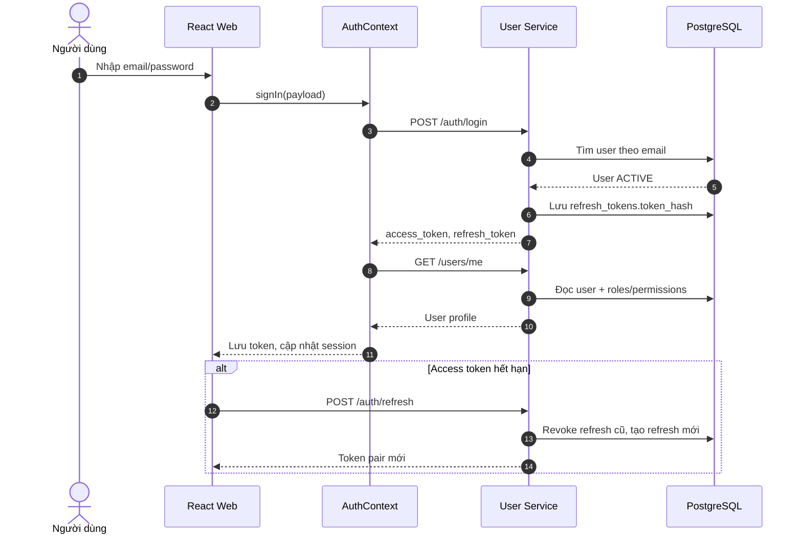
```mermaid
sequenceDiagram
  autonumber
  actor User as Người dùng
  participant Web as React Web
  participant Auth as AuthContext
  participant UserAPI as User Service
  participant DB as PostgreSQL

  User->>Web: Nhập email/password
  Web->>Auth: signIn(payload)
  Auth->>UserAPI: POST /auth/login
  UserAPI->>DB: Tìm user theo email
  DB-->>UserAPI: User ACTIVE
  UserAPI->>DB: Lưu refresh_tokens.token_hash
  UserAPI-->>Auth: access_token, refresh_token
  Auth->>UserAPI: GET /users/me
  UserAPI->>DB: Đọc user + roles/permissions
  UserAPI-->>Auth: User profile
  Auth-->>Web: Lưu token, cập nhật session

  alt Access token hết hạn
    Web->>UserAPI: POST /auth/refresh
    UserAPI->>DB: Revoke refresh cũ, tạo refresh mới
    UserAPI-->>Web: Token pair mới
  end

```

#### 3.3.2. Trình tự xem catalog

Biểu đồ mô tả cách Web gọi Event Service để lấy danh sách event/movie, chi tiết event, showtimes và reviews.

**Hình 12. Biểu đồ trình tự xem catalog, chi tiết và review**

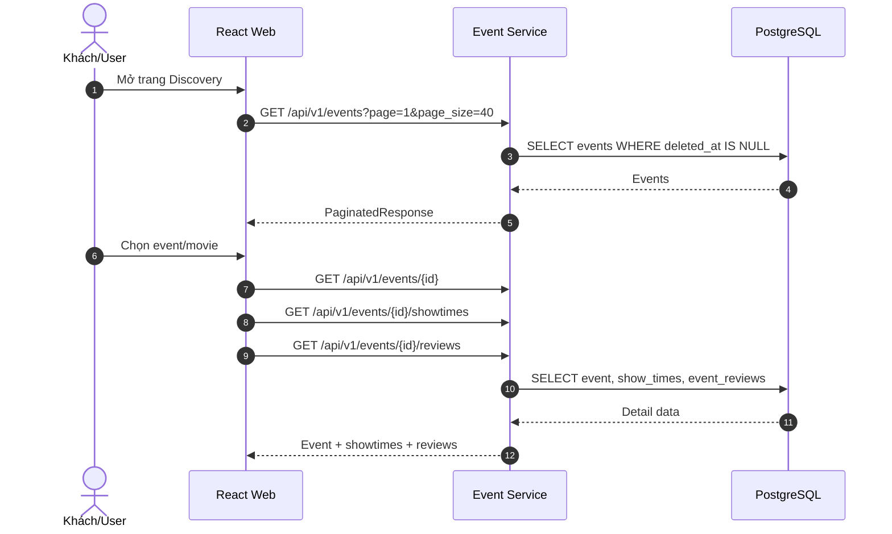
```mermaid
sequenceDiagram
  autonumber
  actor Guest as Khách/User
  participant Web as React Web
  participant EventAPI as Event Service
  participant DB as PostgreSQL

  Guest->>Web: Mở trang Discovery
  Web->>EventAPI: GET /api/v1/events?page=1&page_size=40
  EventAPI->>DB: SELECT events WHERE deleted_at IS NULL
  DB-->>EventAPI: Events
  EventAPI-->>Web: PaginatedResponse
  Guest->>Web: Chọn event/movie
  Web->>EventAPI: GET /api/v1/events/{id}
  Web->>EventAPI: GET /api/v1/events/{id}/showtimes
  Web->>EventAPI: GET /api/v1/events/{id}/reviews
  EventAPI->>DB: SELECT event, show_times, event_reviews
  DB-->>EventAPI: Detail data
  EventAPI-->>Web: Event + showtimes + reviews

```

#### 3.3.3. Trình tự vào hàng đợi ảo

Biểu đồ mô tả Booking Service đọc queue setting từ PostgreSQL và dùng Redis để tính vị trí cũng như quyền vào phòng đặt vé.

**Hình 13. Biểu đồ trình tự hàng đợi ảo**

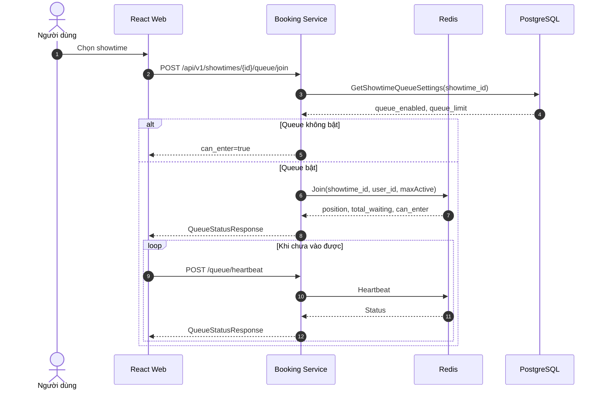
```mermaid
sequenceDiagram
  autonumber
  actor Buyer as Người dùng
  participant Web as React Web
  participant BookingAPI as Booking Service
  participant Redis as Redis
  participant DB as PostgreSQL

  Buyer->>Web: Chọn showtime
  Web->>BookingAPI: POST /api/v1/showtimes/{id}/queue/join
  BookingAPI->>DB: GetShowtimeQueueSettings(showtime_id)
  DB-->>BookingAPI: queue_enabled, queue_limit
  alt Queue không bật
    BookingAPI-->>Web: can_enter=true
  else Queue bật
    BookingAPI->>Redis: Join(showtime_id, user_id, maxActive)
    Redis-->>BookingAPI: position, total_waiting, can_enter
    BookingAPI-->>Web: QueueStatusResponse
    loop Khi chưa vào được
      Web->>BookingAPI: POST /queue/heartbeat
      BookingAPI->>Redis: Heartbeat
      Redis-->>BookingAPI: Status
      BookingAPI-->>Web: QueueStatusResponse
    end
  end

```

#### 3.3.4. Trình tự giữ ghế

Biểu đồ mô tả luồng hold seats với VirtualQueueService, Redis SeatLocker, BookingRepository, transaction PostgreSQL và SeatHub.

**Hình 14. Biểu đồ trình tự giữ ghế và locking**

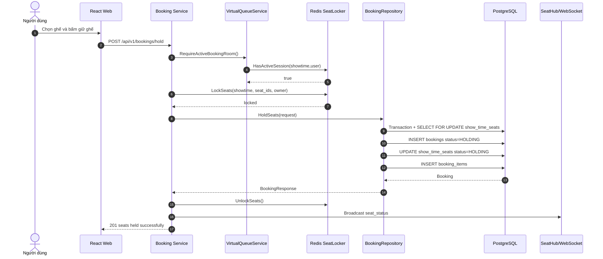
```mermaid
sequenceDiagram
  autonumber
  actor Buyer as Người dùng
  participant Web as React Web
  participant BookingAPI as Booking Service
  participant Queue as VirtualQueueService
  participant Redis as Redis SeatLocker
  participant Repo as BookingRepository
  participant DB as PostgreSQL
  participant WS as SeatHub/WebSocket

  Buyer->>Web: Chọn ghế và bấm giữ ghế
  Web->>BookingAPI: POST /api/v1/bookings/hold
  BookingAPI->>Queue: RequireActiveBookingRoom()
  Queue->>Redis: HasActiveSession(showtime,user)
  Redis-->>Queue: true
  BookingAPI->>Redis: LockSeats(showtime, seat_ids, owner)
  Redis-->>BookingAPI: locked
  BookingAPI->>Repo: HoldSeats(request)
  Repo->>DB: Transaction + SELECT FOR UPDATE show_time_seats
  Repo->>DB: INSERT bookings status=HOLDING
  Repo->>DB: UPDATE show_time_seats status=HOLDING
  Repo->>DB: INSERT booking_items
  DB-->>Repo: Booking
  Repo-->>BookingAPI: BookingResponse
  BookingAPI->>Redis: UnlockSeats()
  BookingAPI->>WS: Broadcast seat_status
  BookingAPI-->>Web: 201 seats held successfully

```

#### 3.3.5. Trình tự xác nhận booking

Biểu đồ mô tả confirm booking, chuyển booking sang PAID, ghế sang SOLD và gửi email xác nhận vé.

**Hình 15. Biểu đồ trình tự xác nhận booking và gửi email**

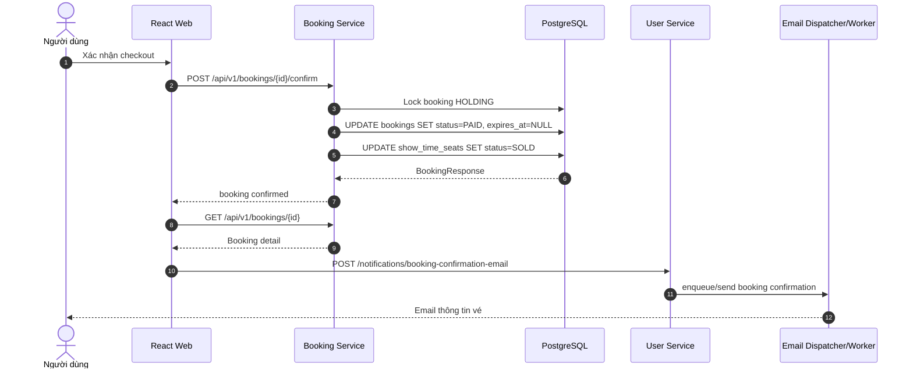
```mermaid
sequenceDiagram
  autonumber
  actor Buyer as Người dùng
  participant Web as React Web
  participant BookingAPI as Booking Service
  participant DB as PostgreSQL
  participant UserAPI as User Service
  participant Mail as Email Dispatcher/Worker

  Buyer->>Web: Xác nhận checkout
  Web->>BookingAPI: POST /api/v1/bookings/{id}/confirm
  BookingAPI->>DB: Lock booking HOLDING
  BookingAPI->>DB: UPDATE bookings SET status=PAID, expires_at=NULL
  BookingAPI->>DB: UPDATE show_time_seats SET status=SOLD
  DB-->>BookingAPI: BookingResponse
  BookingAPI-->>Web: booking confirmed
  Web->>BookingAPI: GET /api/v1/bookings/{id}
  BookingAPI-->>Web: Booking detail
  Web->>UserAPI: POST /notifications/booking-confirmation-email
  UserAPI->>Mail: enqueue/send booking confirmation
  Mail-->>Buyer: Email thông tin vé

```

#### 3.3.6. Trình tự hủy hoặc hết hạn booking

Biểu đồ mô tả hai nhánh xử lý: người dùng hủy booking hoặc job định kỳ release các booking HOLDING quá hạn.

**Hình 16. Biểu đồ trình tự hủy booking và release expired**

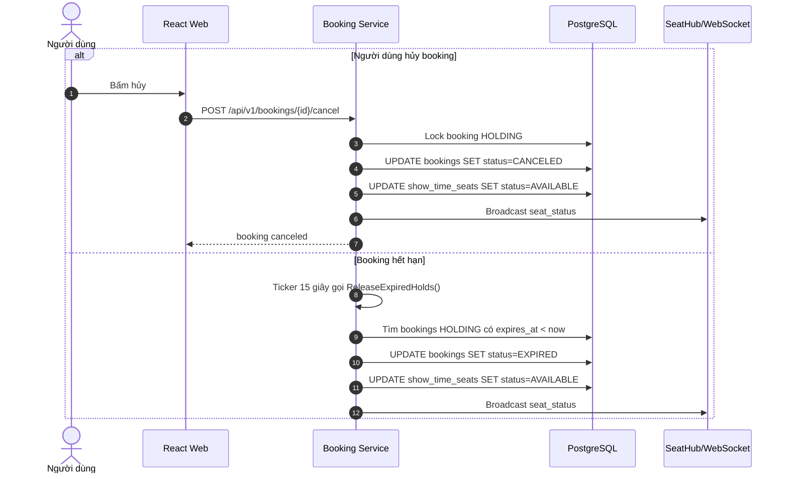
```mermaid
sequenceDiagram
  autonumber
  actor Buyer as Người dùng
  participant Web as React Web
  participant BookingAPI as Booking Service
  participant DB as PostgreSQL
  participant WS as SeatHub/WebSocket

  alt Người dùng hủy booking
    Buyer->>Web: Bấm hủy
    Web->>BookingAPI: POST /api/v1/bookings/{id}/cancel
    BookingAPI->>DB: Lock booking HOLDING
    BookingAPI->>DB: UPDATE bookings SET status=CANCELED
    BookingAPI->>DB: UPDATE show_time_seats SET status=AVAILABLE
    BookingAPI->>WS: Broadcast seat_status
    BookingAPI-->>Web: booking canceled
  else Booking hết hạn
    BookingAPI->>BookingAPI: Ticker 15 giây gọi ReleaseExpiredHolds()
    BookingAPI->>DB: Tìm bookings HOLDING có expires_at < now
    BookingAPI->>DB: UPDATE bookings SET status=EXPIRED
    BookingAPI->>DB: UPDATE show_time_seats SET status=AVAILABLE
    BookingAPI->>WS: Broadcast seat_status
  end

```

#### 3.3.7. Trình tự admin tạo event

Biểu đồ mô tả Admin UI gọi TMDB nếu cần, tạo event và thay thế showtimes/seat map qua Event Service.

**Hình 17. Biểu đồ trình tự quản trị tạo event/showtime/seat map**

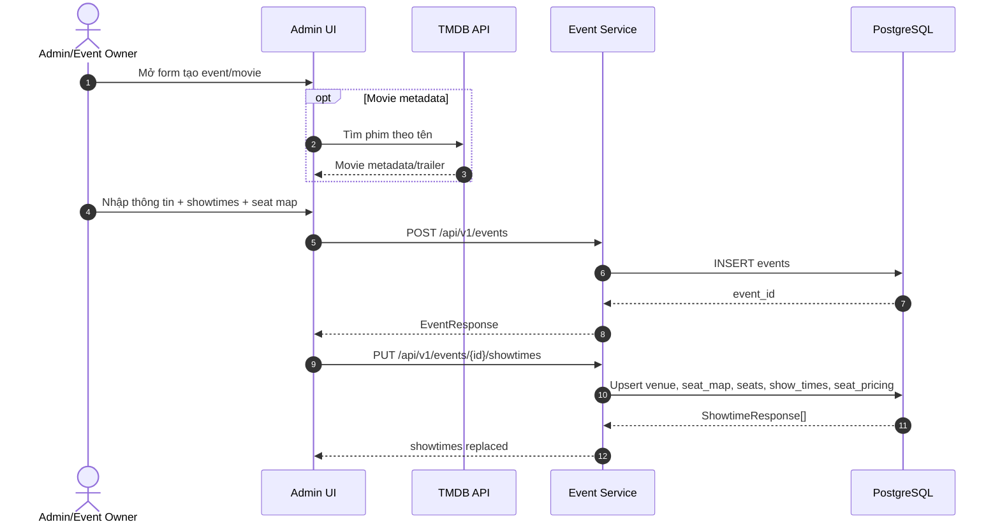
```mermaid
sequenceDiagram
  autonumber
  actor Admin as Admin/Event Owner
  participant Web as Admin UI
  participant TMDB as TMDB API
  participant EventAPI as Event Service
  participant DB as PostgreSQL

  Admin->>Web: Mở form tạo event/movie
  opt Movie metadata
    Web->>TMDB: Tìm phim theo tên
    TMDB-->>Web: Movie metadata/trailer
  end
  Admin->>Web: Nhập thông tin + showtimes + seat map
  Web->>EventAPI: POST /api/v1/events
  EventAPI->>DB: INSERT events
  DB-->>EventAPI: event_id
  EventAPI-->>Web: EventResponse
  Web->>EventAPI: PUT /api/v1/events/{id}/showtimes
  EventAPI->>DB: Upsert venue, seat_map, seats, show_times, seat_pricing
  DB-->>EventAPI: ShowtimeResponse[]
  EventAPI-->>Web: showtimes replaced

```

#### 3.3.8. Trình tự quản lý phân quyền

Biểu đồ mô tả admin xem role, tạo/gán role cho user và sinh notification khi quyền thay đổi.

**Hình 18. Biểu đồ trình tự quản lý role và permission**

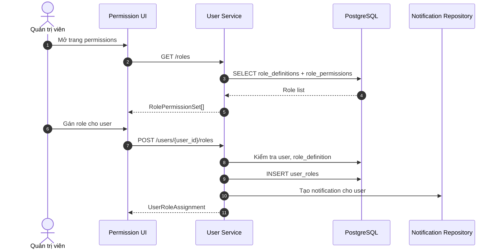
```mermaid
sequenceDiagram
  autonumber
  actor Admin as Quản trị viên
  participant Web as Permission UI
  participant UserAPI as User Service
  participant DB as PostgreSQL
  participant Notify as Notification Repository

  Admin->>Web: Mở trang permissions
  Web->>UserAPI: GET /roles
  UserAPI->>DB: SELECT role_definitions + role_permissions
  DB-->>UserAPI: Role list
  UserAPI-->>Web: RolePermissionSet[]
  Admin->>Web: Gán role cho user
  Web->>UserAPI: POST /users/{user_id}/roles
  UserAPI->>DB: Kiểm tra user, role_definition
  UserAPI->>DB: INSERT user_roles
  UserAPI->>Notify: Tạo notification cho user
  UserAPI-->>Web: UserRoleAssignment

```

#### 3.3.9. Trình tự upload media

Biểu đồ mô tả người dùng upload avatar/video lên MinIO thông qua User Service và cập nhật hồ sơ.

**Hình 19. Biểu đồ trình tự upload media hồ sơ**

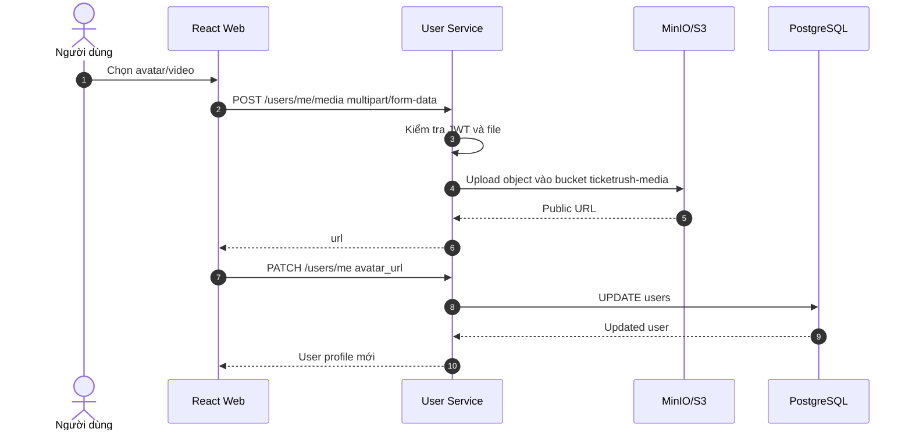
```mermaid
sequenceDiagram
  autonumber
  actor User as Người dùng
  participant Web as React Web
  participant UserAPI as User Service
  participant MinIO as MinIO/S3
  participant DB as PostgreSQL

  User->>Web: Chọn avatar/video
  Web->>UserAPI: POST /users/me/media multipart/form-data
  UserAPI->>UserAPI: Kiểm tra JWT và file
  UserAPI->>MinIO: Upload object vào bucket ticketrush-media
  MinIO-->>UserAPI: Public URL
  UserAPI-->>Web: url
  Web->>UserAPI: PATCH /users/me avatar_url
  UserAPI->>DB: UPDATE users
  DB-->>UserAPI: Updated user
  UserAPI-->>Web: User profile mới

```

### 3.4. BIỂU ĐỒ CỘNG TÁC

Các biểu đồ cộng tác tập trung vào các đối tượng tham gia cùng một ca sử dụng và thứ tự phối hợp giữa chúng.

#### 3.4.1. Cộng tác đăng nhập

Biểu đồ mô tả các đối tượng phối hợp khi đăng nhập: AuthPage, AuthContext, userApi, User Service và PostgreSQL.

**Hình 20. Biểu đồ cộng tác đăng nhập**

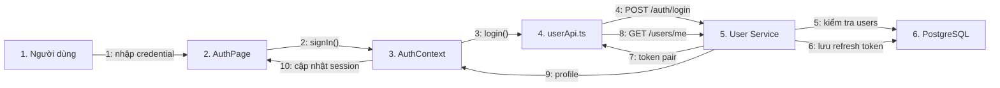
```mermaid
flowchart LR
  user["1. Người dùng"]
  web["2. AuthPage"]
  auth["3. AuthContext"]
  api["4. userApi.ts"]
  userService["5. User Service"]
  db["6. PostgreSQL"]

  user -- "1: nhập credential" --> web
  web -- "2: signIn()" --> auth
  auth -- "3: login()" --> api
  api -- "4: POST /auth/login" --> userService
  userService -- "5: kiểm tra users" --> db
  userService -- "6: lưu refresh token" --> db
  userService -- "7: token pair" --> api
  api -- "8: GET /users/me" --> userService
  userService -- "9: profile" --> auth
  auth -- "10: cập nhật session" --> web

```

#### 3.4.2. Cộng tác xem catalog

Biểu đồ mô tả tương tác giữa trang Discovery/EventDetail, client API, Event Service và PostgreSQL.

**Hình 21. Biểu đồ cộng tác xem catalog/chi tiết**

```mermaid
flowchart LR
  guest["1. Khách/User"]
  page["2. Discovery/EventDetailPage"]
  client["3. ticketRushApi.ts"]
  eventService["4. Event Service"]
  db["5. PostgreSQL"]

  guest -- "1: mở catalog" --> page
  page -- "2: listEventPage()" --> client
  client -- "3: GET /events" --> eventService
  eventService -- "4: query events" --> db
  db -- "5: event list" --> eventService
  guest -- "6: chọn event" --> page
  page -- "7: getEvent(), getShowtimesByEvent()" --> client
  client -- "8: GET detail/showtimes/reviews" --> eventService
  eventService -- "9: dữ liệu chi tiết" --> page

```

#### 3.4.3. Cộng tác virtual queue

Biểu đồ mô tả vai trò của WaitingRoomPage, Booking Handler, VirtualQueueService, Redis Queue và PostgreSQL.

**Hình 22. Biểu đồ cộng tác hàng đợi ảo**

```mermaid
flowchart LR
  buyer["1. Người dùng"]
  waiting["2. WaitingRoomPage"]
  client["3. Booking API Client"]
  booking["4. Booking Handler"]
  queueSvc["5. VirtualQueueService"]
  redis["6. Redis Queue"]
  db["7. PostgreSQL"]

  buyer -- "1: vào queue" --> waiting
  waiting -- "2: joinQueue()" --> client
  client -- "3: POST /queue/join" --> booking
  booking -- "4: parse auth/showtime" --> queueSvc
  queueSvc -- "5: đọc queue settings" --> db
  queueSvc -- "6: join/heartbeat/status" --> redis
  redis -- "7: position/can_enter" --> queueSvc
  queueSvc -- "8: QueueStatusResponse" --> waiting

```

#### 3.4.4. Cộng tác giữ ghế

Biểu đồ mô tả các đối tượng trong nghiệp vụ hold seats, từ SeatSelectionPage tới Redis, repository, database và SeatHub.

**Hình 23. Biểu đồ cộng tác giữ ghế**

```mermaid
flowchart LR
  buyer["1. Người dùng"]
  seatPage["2. SeatSelectionPage"]
  client["3. ticketRushApi.holdSeats"]
  handler["4. BookingHandler"]
  service["5. BookingService"]
  redis["6. Redis SeatLocker"]
  repo["7. BookingRepository"]
  db["8. PostgreSQL"]
  hub["9. SeatHub"]

  buyer -- "1: chọn ghế" --> seatPage
  seatPage -- "2: holdSeats()" --> client
  client -- "3: POST /bookings/hold" --> handler
  handler -- "4: gọi service" --> service
  service -- "5: LockSeats" --> redis
  service -- "6: HoldSeats transaction" --> repo
  repo -- "7: insert booking/items, update seats" --> db
  db -- "8: booking HOLDING" --> repo
  service -- "9: response" --> handler
  handler -- "10: broadcast" --> hub
  handler -- "11: 201" --> seatPage

```

#### 3.4.5. Cộng tác xác nhận booking

Biểu đồ mô tả CheckoutPage phối hợp Booking Service, User Service và Email Dispatcher sau khi xác nhận booking.

**Hình 24. Biểu đồ cộng tác confirm booking và email**

```mermaid
flowchart LR
  buyer["1. Người dùng"]
  checkout["2. CheckoutPage"]
  bookingClient["3. Booking API Client"]
  booking["4. Booking Service"]
  db["5. PostgreSQL"]
  userClient["6. User API Client"]
  userService["7. User Service"]
  mail["8. Email Dispatcher"]

  buyer -- "1: confirm" --> checkout
  checkout -- "2: confirmBooking()" --> bookingClient
  bookingClient -- "3: POST /bookings/{id}/confirm" --> booking
  booking -- "4: update PAID/SOLD" --> db
  db -- "5: BookingResponse" --> booking
  booking -- "6: success" --> checkout
  checkout -- "7: sendBookingConfirmationEmailApi()" --> userClient
  userClient -- "8: POST /notifications/booking-confirmation-email" --> userService
  userService -- "9: queue/send email" --> mail

```

#### 3.4.6. Cộng tác quản trị event

Biểu đồ mô tả AdminCreateEventPage phối hợp TMDB, Event API Client, Event Service, repository và PostgreSQL.

**Hình 25. Biểu đồ cộng tác admin quản lý event**

```mermaid
flowchart LR
  admin["1. Admin/Event Owner"]
  form["2. AdminCreateEventPage"]
  tmdb["3. TMDB Client"]
  eventClient["4. Event API Client"]
  eventService["5. Event Service"]
  repo["6. EventRepository"]
  db["7. PostgreSQL"]

  admin -- "1: nhập form" --> form
  form -- "2: tìm movie metadata" --> tmdb
  form -- "3: createEvent()" --> eventClient
  eventClient -- "4: POST /events" --> eventService
  eventService -- "5: Create()" --> repo
  repo -- "6: insert events" --> db
  eventClient -- "7: PUT /events/{id}/showtimes" --> eventService
  repo -- "8: replace showtimes/seat map/pricing" --> db
  db -- "9: catalog mới" --> form

```

#### 3.4.7. Cộng tác quản lý phân quyền

Biểu đồ mô tả PermissionManagementPage, userApi, Roles Controller, Users Controller và Role/UserRole Repository.

**Hình 26. Biểu đồ cộng tác role/permission**

```mermaid
flowchart LR
  admin["1. Admin"]
  page["2. PermissionManagementPage"]
  api["3. userApi.ts"]
  roles["4. Roles Controller"]
  users["5. Users Controller"]
  repo["6. Role/UserRole Repository"]
  db["7. PostgreSQL"]
  notify["8. Notification"]

  admin -- "1: mở permission UI" --> page
  page -- "2: listRolePermissions()" --> api
  api -- "3: GET /roles" --> roles
  roles -- "4: read roles/permissions" --> repo
  repo -- "5: query" --> db
  admin -- "6: gán role" --> page
  api -- "7: POST /users/{id}/roles" --> users
  users -- "8: assign user_role" --> repo
  repo -- "9: insert user_roles" --> db
  users -- "10: tạo notification" --> notify

```

#### 3.4.8. Cộng tác notification và email

Biểu đồ mô tả Notifications UI, Notifications Controller, EmailDispatcher, Redis/background thread, SMTP và PostgreSQL.

**Hình 27. Biểu đồ cộng tác notification/email**

```mermaid
flowchart LR
  user["1. Người dùng"]
  page["2. Notifications/MyTickets UI"]
  api["3. userApi.ts"]
  notification["4. Notifications Controller"]
  dispatcher["5. EmailDispatcher"]
  queue["6. Redis/Background Thread"]
  smtp["7. SMTP Provider"]
  db["8. PostgreSQL"]

  user -- "1: mở notifications" --> page
  page -- "2: listNotificationsApi()" --> api
  api -- "3: GET /notifications" --> notification
  notification -- "4: read notifications" --> db
  user -- "5: yêu cầu gửi email vé" --> page
  api -- "6: POST /booking-confirmation-email" --> notification
  notification -- "7: send_booking_confirmation()" --> dispatcher
  dispatcher -- "8: enqueue/send" --> queue
  queue -- "9: gửi email" --> smtp

```

### 3.5. BIỂU ĐỒ LỚP

Biểu đồ lớp được chia theo ba miền chính: User/Auth/Role, Event Catalog và Booking Domain. Việc chia nhỏ giúp thể hiện rõ quan hệ dữ liệu mà không làm biểu đồ quá tải.

#### 3.5.1. Lớp User/Auth/Role

Biểu đồ mô tả các lớp người dùng, refresh token, role definition, role permission, user role và notification.

**Hình 28. Biểu đồ lớp User/Auth/Role**

```mermaid
classDiagram
  direction LR
  class User {
    +UUID id
    +String email
    +String full_name
    +String avatar_url
    +Provider provider
    +Role role
    +Status status
  }
  class RefreshToken {
    +UUID id
    +UUID user_id
    +String token_hash
    +DateTime expires_at
    +Boolean revoked
  }
  class RoleDefinition {
    +UUID id
    +String name
  }
  class RolePermission {
    +UUID id
    +UUID role_id
    +String permission
  }
  class UserRole {
    +UUID id
    +UUID user_id
    +UUID role_id
    +DateTime assigned_at
  }
  class Notification {
    +UUID id
    +UUID user_id
    +String title
    +Text message
    +Boolean read
  }

  User "1" --> "0..*" RefreshToken
  User "1" --> "0..*" UserRole
  User "1" --> "0..*" Notification
  RoleDefinition "1" --> "0..*" RolePermission
  RoleDefinition "1" --> "0..*" UserRole

```

#### 3.5.2. Lớp Event/Showtime/Seat map

Biểu đồ mô tả event/movie catalog, review, venue, seat map, seat và showtime.

**Hình 29. Biểu đồ lớp Event/Showtime/Seat map**

```mermaid
classDiagram
  direction LR
  class Event {
    +UUID id
    +UUID creator_id
    +String name
    +EventType event_type
    +String category
    +String venue
    +String status
    +Int max_tickets_per_booking
  }
  class EventReview {
    +UUID id
    +UUID event_id
    +UUID user_id
    +Int rating
    +Text comment
  }
  class Venue {
    +UUID id
    +String name
    +String address
  }
  class SeatMap {
    +UUID id
    +UUID venue_id
    +String name
  }
  class Seat {
    +UUID id
    +UUID seat_map_id
    +String row
    +Int number
    +SeatClass seat_class
  }
  class ShowTime {
    +UUID id
    +UUID event_id
    +UUID venue_id
    +UUID seat_map_id
    +DateTime start_time
    +DateTime end_time
    +Boolean queue_enabled
    +Int queue_limit
  }

  Event "1" --> "0..*" EventReview
  Event "1" --> "0..*" ShowTime
  Venue "1" --> "0..*" SeatMap
  Venue "1" --> "0..*" ShowTime
  SeatMap "1" --> "1..*" Seat
  SeatMap "1" --> "0..*" ShowTime

```

#### 3.5.3. Lớp Booking/Seat/Ticket

Biểu đồ mô tả booking, booking item, showtime seat, seat pricing và vé QR sinh từ booking PAID.

**Hình 30. Biểu đồ lớp Booking/Seat/Ticket**

```mermaid
classDiagram
  direction LR
  class Booking {
    +UUID id
    +UUID user_id
    +UUID show_time_id
    +BookingStatus status
    +DateTime expires_at
  }
  class BookingItem {
    +UUID id
    +UUID booking_id
    +UUID show_time_seat_id
    +Decimal price
  }
  class ShowTimeSeat {
    +UUID id
    +UUID show_time_id
    +UUID seat_id
    +ShowTimeSeatStatus status
    +UUID booking_id
    +DateTime expires_at
  }
  class SeatPricing {
    +UUID id
    +UUID show_time_id
    +UUID seat_id
    +Decimal price
  }
  class Ticket {
    <<derived/client>>
    +String ticket_code
    +String qr_payload
    +DateTime issued_at
  }
  class BookingStatus {
    <<enumeration>>
    HOLDING
    PAID
    CANCELED
    EXPIRED
  }
  class ShowTimeSeatStatus {
    <<enumeration>>
    AVAILABLE
    HOLDING
    SOLD
  }

  Booking "1" --> "1..*" BookingItem
  Booking "1" --> "0..*" Ticket
  ShowTimeSeat "1" --> "0..1" BookingItem
  ShowTimeSeat "1" --> "0..1" Ticket
  SeatPricing "1" --> "0..*" BookingItem : supplies_price

```

### 3.6. BIỂU ĐỒ TRẠNG THÁI

Các biểu đồ trạng thái mô tả vòng đời các đối tượng có thay đổi trạng thái rõ ràng trong hệ thống: booking, ghế theo showtime, phiên người dùng và hàng đợi ảo.

#### 3.6.1. Trạng thái Booking

Booking bắt đầu ở HOLDING và kết thúc ở PAID, CANCELED hoặc EXPIRED.

**Hình 31. Biểu đồ trạng thái Booking**

```mermaid
stateDiagram-v2
  [*] --> HOLDING: hold seats
  HOLDING --> PAID: confirm booking
  HOLDING --> CANCELED: cancel booking
  HOLDING --> EXPIRED: ReleaseExpiredHolds
  PAID --> [*]
  CANCELED --> [*]
  EXPIRED --> [*]

```

#### 3.6.2. Trạng thái ShowtimeSeat

Ghế bắt đầu AVAILABLE, chuyển sang HOLDING khi được giữ, SOLD khi xác nhận, hoặc trở lại AVAILABLE khi hủy/hết hạn.

**Hình 32. Biểu đồ trạng thái ghế theo showtime**

```mermaid
stateDiagram-v2
  [*] --> AVAILABLE
  AVAILABLE --> HOLDING: POST /bookings/hold
  HOLDING --> SOLD: POST /bookings/{id}/confirm
  HOLDING --> AVAILABLE: cancel booking
  HOLDING --> AVAILABLE: hold expired
  SOLD --> [*]

```

#### 3.6.3. Trạng thái User Session

Phiên người dùng chuyển từ anonymous sang authenticated, refreshing, anonymous hoặc blocked tùy trạng thái token/tài khoản.

**Hình 33. Biểu đồ trạng thái phiên người dùng**

```mermaid
stateDiagram-v2
  [*] --> Anonymous
  Anonymous --> Registered: POST /auth/register
  Anonymous --> Authenticated: POST /auth/login hoặc OAuth
  Registered --> Authenticated: token pair issued
  Authenticated --> Refreshing: access token expired
  Refreshing --> Authenticated: POST /auth/refresh success
  Refreshing --> Anonymous: refresh invalid/reused
  Authenticated --> Anonymous: logout
  Authenticated --> Blocked: admin blocks user
  Blocked --> [*]

```

#### 3.6.4. Trạng thái Virtual Queue

Người dùng trong queue có thể ở NotInQueue, Waiting, ActiveRoom hoặc Removed.

**Hình 34. Biểu đồ trạng thái virtual queue**

```mermaid
stateDiagram-v2
  [*] --> NotInQueue
  NotInQueue --> Waiting: join queue
  Waiting --> Waiting: heartbeat, can_enter=false
  Waiting --> ActiveRoom: can_enter=true
  ActiveRoom --> ActiveRoom: heartbeat
  ActiveRoom --> NotInQueue: leave queue
  Waiting --> Removed: heartbeat timeout/leave page
  Removed --> NotInQueue: join again

```

### 3.7. BIỂU ĐỒ THÀNH PHẦN

Biểu đồ thành phần mô tả cấu trúc module triển khai, các service nghiệp vụ và phụ thuộc hạ tầng.

#### 3.7.1. Thành phần User Service

Biểu đồ mô tả các controller và service trong User Service cùng phụ thuộc PostgreSQL, Redis, MinIO, SMTP và OAuth provider.

**Hình 35. Biểu đồ thành phần User Service**

```mermaid
flowchart LR
  web["React Web"]
  auth["Auth Controller"]
  users["Users Controller"]
  roles["Roles Controller"]
  noti["Notifications Controller"]
  token["TokenService"]
  oauth["OAuthVerifier"]
  storage["StorageService"]
  email["EmailDispatcher/Worker"]
  db[("PostgreSQL")]
  redis[("Redis email queue/rate limit")]
  minio[("MinIO/S3")]
  smtp["SMTP"]
  provider["Google/Facebook"]

  web --> auth
  web --> users
  web --> roles
  web --> noti
  auth --> token
  auth --> oauth
  users --> storage
  noti --> email
  token --> db
  auth --> db
  users --> db
  roles --> db
  noti --> db
  oauth --> provider
  storage --> minio
  email --> redis
  email --> smtp

```

#### 3.7.2. Thành phần Event Service

Biểu đồ mô tả EventHandler, EventService, EventRepository, Swagger, metrics và PostgreSQL.

**Hình 36. Biểu đồ thành phần Event Service**

```mermaid
flowchart LR
  web["React/Admin Web"]
  handler["EventHandler"]
  service["EventService"]
  repo["EventRepository"]
  db[("PostgreSQL")]
  swagger["Swagger/OpenAPI"]
  metrics["/metrics"]

  web --> handler
  handler --> service
  service --> repo
  repo --> db
  handler --> swagger
  handler --> metrics
  repo -->|"events, reviews, show_times, seat_maps, seats, seat_pricing"| db

```

#### 3.7.3. Thành phần Booking Service

Biểu đồ mô tả BookingHandler, BookingService, VirtualQueueService, Redis SeatLocker, Redis QueueManager, BookingRepository và SeatHub.

**Hình 37. Biểu đồ thành phần Booking Service**

```mermaid
flowchart LR
  web["React Web + WebSocket"]
  handler["BookingHandler"]
  service["BookingService"]
  queueSvc["VirtualQueueService"]
  locker["Redis SeatLocker"]
  queue["Redis QueueManager"]
  repo["BookingRepository"]
  hub["SeatHub"]
  db[("PostgreSQL")]
  redis[("Redis")]

  web --> handler
  handler --> service
  handler --> queueSvc
  handler --> hub
  service --> locker
  service --> repo
  queueSvc --> queue
  queueSvc --> repo
  locker --> redis
  queue --> redis
  repo --> db
  hub --> web

```

#### 3.7.4. Thành phần tổng thể

Biểu đồ mô tả toàn bộ hệ thống gồm Web, User Service, Event Service, Booking Service, Migration Service, PostgreSQL, Redis, MinIO, SMTP, OAuth và TMDB.

**Hình 38. Biểu đồ thành phần tổng thể TicketRush**

```mermaid
flowchart LR
  browser["Browser"]
  web["TicketRush Web<br/>React + Nginx"]
  userApi["User Service"]
  eventApi["Event Service"]
  bookingApi["Booking Service"]
  migration["Migration Service"]
  postgres[("PostgreSQL")]
  redis[("Redis")]
  minio[("MinIO")]
  smtp["SMTP"]
  oauth["OAuth Providers"]
  tmdb["TMDB"]

  browser --> web
  web --> userApi
  web --> eventApi
  web --> bookingApi
  web --> tmdb
  userApi --> postgres
  userApi --> redis
  userApi --> minio
  userApi --> smtp
  userApi --> oauth
  eventApi --> postgres
  bookingApi --> postgres
  bookingApi --> redis
  migration --> postgres

```

### 3.8. BIỂU ĐỒ TRIỂN KHAI

Biểu đồ triển khai thể hiện cách hệ thống chạy trong môi trường Docker Compose và cách request từ browser được định tuyến qua Nginx tới các backend services.

#### 3.8.1. Triển khai container

Biểu đồ mô tả các container, port và volume chính trong môi trường Docker Compose.

**Hình 39. Biểu đồ triển khai Docker Compose**

```mermaid
flowchart TB
  client["Client Browser"]
  subgraph host["Docker host"]
    web["web: Nginx + React<br/>3000:80"]
    user["user_api: Flask<br/>8082"]
    event["event_api: Go/Gin<br/>8080"]
    booking["booking_api: Go/Gin/WebSocket<br/>8081"]
    migrations["migrations: goose"]
    postgres["postgres:16<br/>5432"]
    redis["redis:7<br/>6379"]
    minio["minio<br/>9000/9001"]
    pgvol[("postgres_data")]
    miniovol[("minio_data")]
  end

  client --> web
  web --> user
  web --> event
  web --> booking
  web --> minio
  migrations --> postgres
  user --> postgres
  event --> postgres
  booking --> postgres
  booking --> redis
  user --> redis
  user --> minio
  postgres --> pgvol
  minio --> miniovol

```

#### 3.8.2. Triển khai định tuyến request

Biểu đồ mô tả cách Nginx trong Web container định tuyến request tới User/Event/Booking/MinIO.

**Hình 40. Biểu đồ triển khai request routing qua Nginx**

```mermaid
flowchart LR
  browser["Browser"]
  nginx["Web container Nginx"]
  static["Static React app"]
  userApi["user_api:8082"]
  eventApi["event_api:8080"]
  bookingApi["booking_api:8081"]
  minio["minio:9000"]

  browser -->|"GET /"| nginx
  nginx --> static
  browser -->|"/user-api/*"| nginx
  nginx -->|"proxy_pass http://user_api:8082/"| userApi
  browser -->|"/event-api/*"| nginx
  nginx -->|"proxy_pass http://event_api:8080/"| eventApi
  browser -->|"/booking-api/* + WS upgrade"| nginx
  nginx -->|"proxy_pass http://booking_api:8081/"| bookingApi
  browser -->|"/ticketrush-media/*"| nginx
  nginx -->|"proxy_pass http://minio:9000/"| minio

```

## CHƯƠNG IV: ĐỐI CHIẾU VÀ KẾT LUẬN

### 4.1. Đối chiếu thiết kế với hệ thống

| Nhóm thiết kế | Nội dung đối chiếu |
| --- | --- |
| Use Case | Các actor và use case khớp màn hình React, controller/handler backend và các tích hợp ngoài. |
| Hoạt động | Các quy trình auth, discovery, queue, hold, checkout và admin create event khớp luồng xử lý thực tế. |
| Trình tự | Endpoint và thứ tự message khớp với client API, handler, service, repository, Redis và PostgreSQL. |
| Cộng tác | Các đối tượng UI, API client, service, repository và hạ tầng phối hợp đúng theo trách nhiệm từng lớp. |
| Lớp | Lớp và quan hệ lấy từ model Python/Go và schema migration; Ticket QR được xem là dữ liệu sinh từ booking PAID ở Web. |
| Trạng thái | Booking status và seat status khớp enum của Booking Service. |
| Thành phần | Component boundary khớp User/Event/Booking services và các phụ thuộc Postgres/Redis/MinIO/OAuth/SMTP. |
| Triển khai | Container, port, volume và Nginx proxy khớp cấu hình triển khai hiện tại. |

### 4.2. Kết luận

TicketRush là hệ thống bán vé trực tuyến có kiến trúc nhiều service, tách rõ miền người dùng, catalog sự kiện/phim và booking. Thiết kế hướng đối tượng của hệ thống tập trung vào các lớp nghiệp vụ như User, Event, Showtime, SeatMap, Seat, Booking, BookingItem, ShowtimeSeat và các lớp phân quyền. Luồng đặt vé được bảo vệ bằng JWT, hàng đợi ảo, Redis seat lock, transaction PostgreSQL và WebSocket realtime, giúp giảm rủi ro bán trùng ghế trong tình huống nhiều người dùng thao tác đồng thời.

Các biểu đồ trong báo cáo đã mô tả đầy đủ các góc nhìn chính của OOAD: hành vi người dùng qua use case, dòng xử lý qua activity, tương tác thời gian qua sequence, phối hợp đối tượng qua collaboration, cấu trúc dữ liệu qua class, vòng đời trạng thái qua state, kiến trúc module qua component và hạ tầng chạy thực tế qua deployment.
